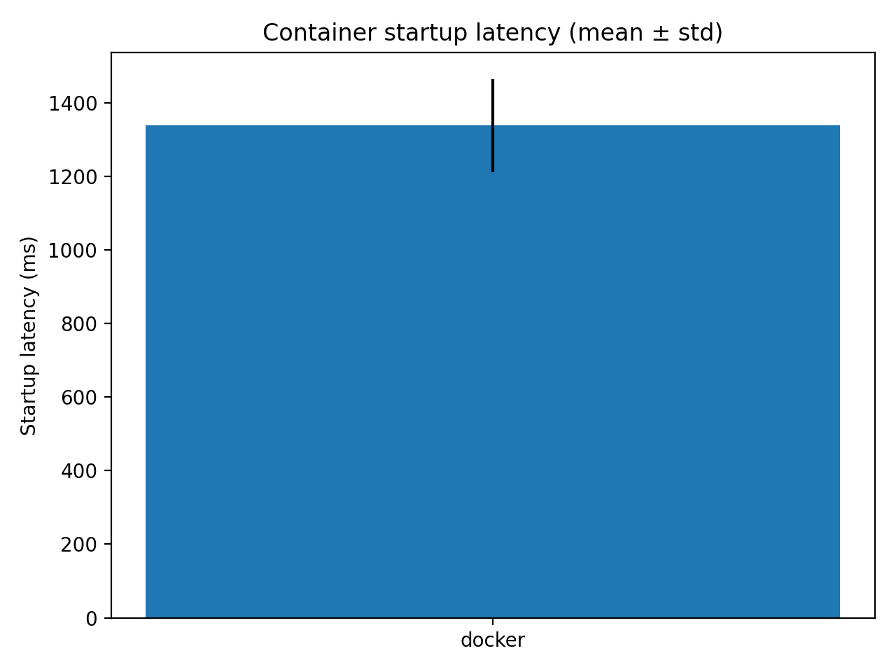

# container-bench

Goal: run a tiny C program in a container and measure **startup time** and **RSS memory**, outputting `results.csv` and `summary.csv`.

## How to run

1. `docker build -t bench .`
2. `.\benchmark.ps1`
3. `python .\scripts\aggregate.py`

## Outputs

- `results.csv` (raw runs)
- `summary.csv` (aggregated stats)

## Results

The results show consistent container startup overhead on Docker, with variance across runs likely due to cold-start effects and host scheduling noise.

